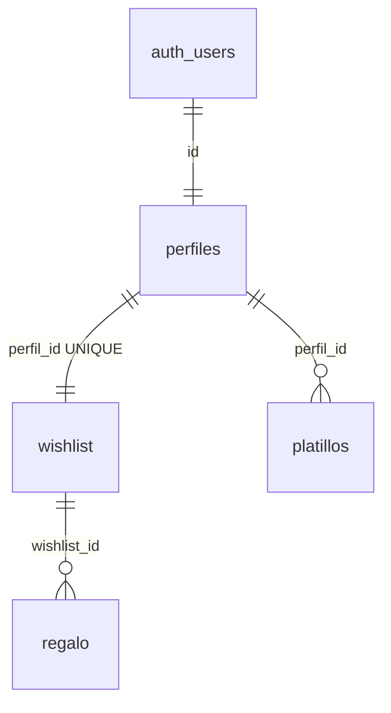

<!-- BEGIN:nextjs-agent-rules -->
# This is NOT the Next.js you know

This version has breaking changes — APIs, conventions, and file structure may all differ from your training data. Read the relevant guide in `node_modules/next/dist/docs/` before writing any code. Heed deprecation notices.
<!-- END:nextjs-agent-rules -->

---

# Intercambio2026 — Architecture & Conventions

This document is the **single source of truth** for AI coding agents and technical contributors. It covers architecture, database schema, security model, auth flow, and implementation conventions.

> **Do not reintroduce dev bypass flags.** The codebase previously had a `NEXT_PUBLIC_DEV_SKIP_AUTH` / `lib/dev-flags.ts` development bypass. This was intentionally removed. Never add mock auth paths, dev-only stubs, or bypass environment variables back into the codebase.

## Tech Stack

| Category | Technology | Version |
|----------|------------|---------|
| Framework | [Next.js](https://nextjs.org/) (App Router) | 16.2.6 |
| UI library | React | 19 |
| Language | TypeScript | 5.9 |
| Styling | Tailwind CSS (CSS-first config, no `tailwind.config.*`) | v4 |
| Database & Auth | [Supabase](https://supabase.com/) (PostgreSQL + Auth) via `@supabase/supabase-js` | 2.106 |
| UI primitives | Radix UI, `lucide-react`, shadcn-style components in `app/components/ui/` | — |
| Tooling | ESLint 9, Supabase CLI (devDependency) | — |

## Project Structure

```
app/
  layout.tsx                 # Root layout; wraps app in AuthProvider
  page.tsx                   # Home page (Server Component)
  globals.css                # Tailwind v4 CSS-first config + theme tokens
  login/page.tsx             # Login route (client guard)
  signup/page.tsx            # Signup route (client guard)
  forgot-password/page.tsx   # Request password reset email (client guard)
  reset-password/page.tsx    # Set new password from recovery link
  profile/page.tsx           # Profile route (client guard)
  components/
    header.tsx               # Navigation, auth status, "Cargando sesión…"
    hero-countdown.tsx       # Live countdown to event date
    rules-section.tsx        # Exchange rules
    wishlist-section.tsx     # Family wishlist display (home)
    potluck-section.tsx      # Potluck dish list (home or profile)
    profile-page.tsx         # Profile editing UI
    my-wishlist-editor.tsx   # User's own wishlist CRUD
    login-page.tsx           # Login form component
    signup-page.tsx          # Signup form component
    confirm-email-page.tsx   # Post-signup email confirmation prompt
    forgot-password-page.tsx # Request password reset form + email-sent success
    reset-password-page.tsx  # New password form + invalid recovery link state
    ui/                      # Reusable UI primitives (button, card, input, etc.)
  providers/
    auth-provider.tsx        # Session context and auth state
lib/
  supabaseClient.ts          # Supabase browser client (single entry point)
  types.ts                   # Shared TypeScript types
  wishlist-data.ts           # Wishlist fetch/mutate helpers
  potluck-data.ts            # Potluck fetch/mutate helpers
  auth-errors.ts             # Supabase error → Spanish message mapper
  event-date.ts              # Event date constant + useCountdown hook
supabase/
  migrations/                # SQL migrations (applied in order by timestamp)
  config.toml                # Supabase CLI configuration
```

### Routes

| Path | Auth | Purpose |
|------|------|---------|
| `/` | Public (lists require login) | Home — countdown, rules, read-only wishlist & potluck |
| `/login` | Logged-out | User login; redirects to `/profile` when session confirmed |
| `/signup` | Logged-out | User registration; shows confirm-email screen when no session; redirects to `/profile` when session is issued immediately |
| `/forgot-password` | Logged-out | Request password reset email; shows "revisa tu correo" success state; redirects to `/profile` if already logged in |
| `/reset-password` | Recovery session | Set new password via Supabase recovery link; redirects to `/profile` on success; shows invalid-link state when no session |
| `/profile` | Required | Authenticated profile — edit wishlist & potluck |

Route protection is **client-side only** (Option A). Each route page checks `isAuthLoading` before redirecting, preventing flash of unauthenticated UI. No `middleware.ts` or `@supabase/ssr` integration exists yet.

## Database Architecture

Normalized relational model in Supabase PostgreSQL. **Table and column names are in Spanish** — do not invent English equivalents when writing queries.



### Tables

#### `perfiles` (profiles)

User profile linked 1:1 to Supabase Auth.

| Column | Type | Notes |
|--------|------|-------|
| `id` | `uuid` | PK; FK to `auth.users(id)` ON DELETE CASCADE |
| `nombre` | `text` | Display name |
| `correo` | `text` | Email |

#### `wishlist`

Gift wishlist container. One per profile.

| Column | Type | Notes |
|--------|------|-------|
| `wishlist_id` | `uuid` | PK; default `gen_random_uuid()` |
| `perfil_id` | `uuid` | FK to `perfiles(id)` ON DELETE CASCADE; **UNIQUE** |

#### `regalo`

Individual gift items on a wishlist.

| Column | Type | Notes |
|--------|------|-------|
| `regalo_id` | `uuid` | PK; default `gen_random_uuid()` |
| `wishlist_id` | `uuid` | FK to `wishlist(wishlist_id)` ON DELETE CASCADE |
| `descripcion_regalo` | `text` | Gift description (required) |

#### `platillos`

Dishes a user plans to bring to the potluck.

| Column | Type | Notes |
|--------|------|-------|
| `platillo_id` | `uuid` | PK; default `gen_random_uuid()` |
| `perfil_id` | `uuid` | FK to `perfiles(id)` ON DELETE CASCADE |
| `descripcion_platillo` | `text` | Dish description (required) |

All foreign keys use `ON DELETE CASCADE`.

### Migrations

Applied in order:

1. `20260531031958_remote_schema.sql` — initial schema (tables, RLS, triggers)
2. `20260601120000_delete_own_account.sql` — `delete_own_account()` RPC
3. `20260601130000_security_audit_fixes.sql` — `perfiles` SELECT-all policy + revoke `handle_new_user` grants

Apply via:
```bash
supabase link --project-ref <project-ref>
supabase db push
```

### Automated user provisioning: `handle_new_user`

When a new row is inserted into `auth.users`, the trigger `on_auth_user_created` runs `handle_new_user()` (`SECURITY DEFINER`):

1. Inserts a `perfiles` row with `id = new.id`, `nombre` from `new.raw_user_meta_data->>'nombre'`, `correo` from `new.email`.
2. Inserts a `wishlist` row with `perfil_id = new.id`.

**Signup must pass `nombre` in user metadata:**

```typescript
await supabase.auth.signUp({
  email,
  password,
  options: { data: { nombre: displayName } },
});
```

Grants: only `service_role` and `postgres` can call this function. `anon` and `authenticated` grants were revoked in migration `20260601130000`.

## Security Model

RLS is enabled on all four public tables.

### RLS Policies

| Policy name | Table | Operation | Role | Rule |
|-------------|-------|-----------|------|------|
| Usuarios pueden ver su propio perfil | `perfiles` | SELECT | all | `auth.uid() = id` |
| Todos los usuarios pueden ver todos los perfiles | `perfiles` | SELECT | `authenticated` | `true` |
| Todos los usuarios pueden ver todas las listas | `wishlist` | SELECT | `authenticated` | `true` |
| Usuarios pueden ver su wishlist | `wishlist` | SELECT | all | `auth.uid() = perfil_id` |
| Todos los usuarios pueden ver todos los regalos | `regalo` | SELECT | `authenticated` | `true` |
| Usuarios pueden editar sus regalos | `regalo` | ALL | all | `auth.uid()` IN (SELECT `perfil_id` FROM `wishlist` WHERE `wishlist_id` = `regalo.wishlist_id`) |
| Todos los usuarios pueden ver todos los platillos | `platillos` | SELECT | `authenticated` | `true` |
| Usuarios pueden editar sus platillos | `platillos` | ALL | all | `auth.uid() = perfil_id` |

**Summary:**
- `perfiles` — own profile + all authenticated can read (needed for family list name joins)
- `wishlist` — all authenticated can read; no client INSERT/UPDATE/DELETE (created by trigger)
- `regalo` — all authenticated can read; owner-only writes (via wishlist ownership subquery)
- `platillos` — all authenticated can read; owner-only writes

### `delete_own_account` RPC

`SECURITY DEFINER` function that deletes the current user's row from `auth.users`, which cascades to `perfiles`, `wishlist`, `regalo`, and `platillos`. Then signs out and clears client session.

Grants: `REVOKE ALL FROM PUBLIC` then `GRANT EXECUTE TO authenticated` only.

### Key security rules

- No service-role key in frontend code or environment variables
- All Supabase access goes through the anon/publishable key + RLS
- Wishlist data is **shared among authenticated users** by design (not private)

## AuthProvider API

[`app/providers/auth-provider.tsx`](app/providers/auth-provider.tsx) wraps the application. Consume via `useAuth()`:

```typescript
type AuthContextValue = {
  session: Session | null;
  userId: string | null;           // session.user.id === perfiles.id
  isLoggedIn: boolean;             // derived from !!session
  isAuthLoading: boolean;          // true until initial getSession() resolves
  login: (email, password) => Promise<{ error: string | null }>;
  signup: (name, email, password) => Promise<{ error: string | null }>;
  logout: () => void;
  deleteAccount: () => Promise<{ error: string | null }>;
  requestPasswordReset: (email) => Promise<{ error: string | null }>;
  updatePassword: (password) => Promise<{ error: string | null }>;
  currentUser: { name: string } | null;
};
```

- `isAuthLoading` starts `true`, flips to `false` after `getSession()` resolves and on every `onAuthStateChange` event.
- `login` calls `signInWithPassword` and syncs session immediately on success.
- `signup` calls `signUp` with `nombre` in user metadata; syncs session when Supabase returns one.
- `logout` calls `signOut()`.
- `deleteAccount` calls the `delete_own_account` RPC then signs out.
- `requestPasswordReset` calls `resetPasswordForEmail` with `redirectTo: ${origin}/reset-password`.
- `updatePassword` calls `updateUser({ password })` after the user lands on `/reset-password` from the recovery email link.

### Error mapping

[`lib/auth-errors.ts`](lib/auth-errors.ts) maps Supabase English error messages to Spanish:

```typescript
import { mapAuthError, ACCOUNT_NOT_FOUND_MESSAGE } from "@/lib/auth-errors";
const userMessage = mapAuthError(rawSupabaseError);
// "Invalid login credentials." → ACCOUNT_NOT_FOUND_MESSAGE
// ("No se encontró tu cuenta. Revisa tus datos o regístrate.")
```

When login fails with invalid credentials, [`app/components/login-page.tsx`](app/components/login-page.tsx) detects `ACCOUNT_NOT_FOUND_MESSAGE` and renders "regístrate" as an inline button linking to `/signup` (the rest of the message stays plain text).

## Data Layer

Gift ideas are individual `regalo` rows (not a single text field). Helpers in:

- [`lib/wishlist-data.ts`](lib/wishlist-data.ts) — `fetchFamilyWishlists`, `fetchMyWishlist`, `addRegalo`, `deleteRegalo`, `updateRegalo`
- [`lib/potluck-data.ts`](lib/potluck-data.ts) — `fetchFamilyPlatillos`, `fetchMyPlatillos`, `addPlatillo`, `deletePlatillo`

All helpers return `{ data, error }` with Spanish error strings for validation failures and raw Supabase messages for API errors.

| Page | Gifts | Dishes |
|------|-------|--------|
| `/` (landing) | Read-only: all family wishlists | Read-only: all `platillos` |
| `/profile` | Add/update/delete own `regalo` rows | Add/delete own `platillos` |

Landing lists require login (RLS grants SELECT to `authenticated` only). Guests see a sign-in CTA.

## Development Conventions

### Server Components by default

Use React Server Components unless the component needs client-side interactivity. Add `"use client"` only at the boundary that requires it. Current pattern: `app/page.tsx` is a Server Component composing `"use client"` section components.

### Database access

All Supabase interactions go through the single client in [`lib/supabaseClient.ts`](lib/supabaseClient.ts). Do not create ad-hoc Supabase clients. No `@supabase/ssr` or server-side cookie client exists yet.

### Spanish-first UI

The app is Spanish-first (`lang="es"` in root layout). Table/column names stay in Spanish. UI copy, error messages, and labels are in Spanish.

### Import convention

Use absolute path aliases: `@/lib/...`, `@/app/...`. Do not use relative paths like `../../lib/...`.

### Shared countdown logic

[`lib/event-date.ts`](lib/event-date.ts) exports `EVENT_DATE` and `useCountdown()` hook. Used by both `hero-countdown.tsx` and `profile-page.tsx`.

## Implementation Status

| Area | Status |
|------|--------|
| Home UI (hero, rules, wishlist, potluck) | Live data when logged in; login CTA for guests |
| Auth loading state (`isAuthLoading`) | Header shows "Cargando sesión…"; route pages guard on loading |
| Auth pages (login, signup) | Built; wired to Supabase; Spanish error mapping; signup shows confirm-email screen when email confirmation is required |
| Password recovery | `/forgot-password` + `/reset-password`; login links to forgot flow; recovery session via Supabase email link |
| AuthProvider | Session listener; `login`/`signup`/`logout`/`deleteAccount`/`requestPasswordReset`/`updatePassword`/`isAuthLoading` |
| Profile wishlist/potluck CRUD | Connected via `regalo` and `platillos` tables |
| Account deletion | Profile button + `delete_own_account` RPC |
| Profile countdown widget | Live countdown via `useCountdown()` |
| Middleware / server-side route protection | **None** (client-side guards only) |
| Secret Santa assignment | **Placeholder** on profile page ("Proximamente") |
| Tests / CI | **None yet** |

## Deployment Notes

- **Single Supabase free project** for both local dev and production (same DB, same credentials).
- Dev actions affect production data — use test accounts carefully.
- Supabase free tier pauses after 1 week of inactivity — ping the dashboard before the event.
- Vercel Hobby (free) plan for deployment.
- Environment variables: `NEXT_PUBLIC_SUPABASE_URL` + `NEXT_PUBLIC_SUPABASE_PUBLISHABLE_KEY` only. No dev flags, no service-role key.
- **Supabase Auth redirect URLs:** add `${origin}/reset-password` for both local dev (e.g. `http://localhost:3000/reset-password`) and the production domain in the Supabase dashboard under Authentication → URL Configuration.

## Out of Scope / Future Work

- **`@supabase/ssr` + `middleware.ts`** — Option B for server-side session protection. Not needed for v1.
- **Secret Santa** — Post-launch feature: `asignaciones` table + admin RPC for randomized pairings + profile UI.
- **Inline edit for `regalo` rows** — RLS allows owner UPDATE; UI for it is optional.
- **CI/CD** — GitHub Actions with Vitest + Playwright planned but not yet implemented.
