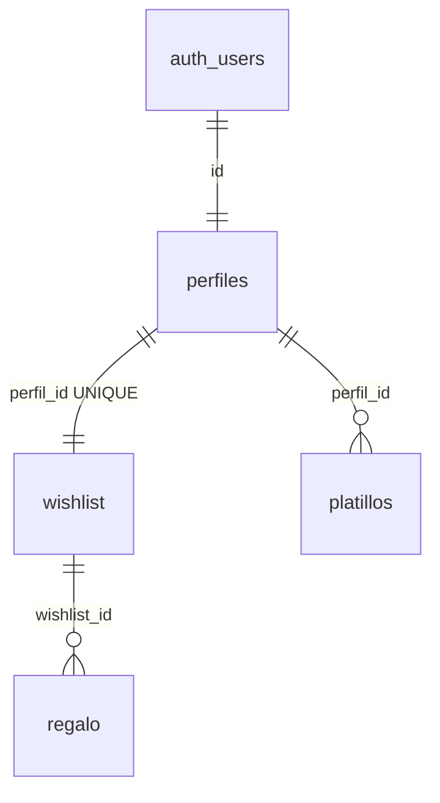

# Intercambio2026

Single source of truth for architecture, database schema, security model, and current implementation status. Intended for human developers and AI coding assistants working on this repository.

## Project Overview

Intercambio2026 is a web application for coordinating a family potluck dinner and gift exchange (Intercambio). Family members can register, list the dishes they will bring to the potluck, and manage their gift wishlists for the exchange.

The UI is Spanish-first (`lang="es"` in the root layout) and includes a countdown to the event date (2026-12-25).

**Current maturity:** UI prototype with Supabase schema deployed; application integration (auth wiring and database reads/writes) is in progress.

## Tech Stack

| Category | Technology |
|----------|------------|
| Framework | [Next.js 16.2.6](https://nextjs.org/) (App Router) |
| UI library | React 19 |
| Language | TypeScript 5 |
| Styling | Tailwind CSS v4 (CSS-first config in [`app/globals.css`](app/globals.css); no `tailwind.config.*`) |
| Database & Auth | [Supabase](https://supabase.com/) (PostgreSQL + Auth) via `@supabase/supabase-js` |
| UI primitives | Radix UI (`@radix-ui/react-label`, `@radix-ui/react-slot`), `lucide-react`, shadcn-style components in [`app/components/ui/`](app/components/ui/) |
| Tooling | ESLint, Supabase CLI (devDependency) |

## Getting Started

### Prerequisites

- Node.js (LTS recommended)
- A Supabase project with the schema applied (see [Database Architecture](#database-architecture))

### Local setup

1. Clone the repository and install dependencies:

   ```bash
   npm install
   ```

2. Create a `.env.local` file in the project root (see [Environment Variables](#environment-variables)).

3. Start the development server:

   ```bash
   npm run dev
   ```

4. Open [http://localhost:3000](http://localhost:3000).

### Available scripts

| Script | Description |
|--------|-------------|
| `npm run dev` | Start Next.js development server |
| `npm run build` | Production build |
| `npm run start` | Run production server |
| `npm run lint` | Run ESLint |

### Supabase schema

The database schema is defined in [`supabase/migrations/20260531031958_remote_schema.sql`](supabase/migrations/20260531031958_remote_schema.sql). Apply it to your Supabase project via the Supabase CLI or dashboard before testing authenticated features.

## Project Structure

```
app/
  layout.tsx                 # Root layout; wraps app in AuthProvider
  page.tsx                   # Home page (Server Component)
  login/                     # Login route
  signup/                    # Signup route
  profile/                   # Profile route (wishlist + potluck editing)
  components/
    header.tsx               # Navigation and auth actions
    hero-countdown.tsx       # Event countdown
    rules-section.tsx        # Exchange rules
    wishlist-section.tsx     # Gift wishlist display
    potluck-section.tsx      # Potluck dish list
    profile-page.tsx         # Profile editing UI
    login-page.tsx           # Login form
    signup-page.tsx          # Signup form
    ui/                      # Reusable UI primitives (button, card, input, etc.)
  providers/
    auth-provider.tsx        # Session context and auth state
lib/
  supabaseClient.ts          # Supabase browser client (single entry point for DB/auth)
supabase/
  migrations/                # SQL migrations
  config.toml                # Supabase CLI configuration
```

### Routes

| Path | Purpose |
|------|---------|
| `/` | Home — countdown, rules, read-only wishlist and potluck sections |
| `/login` | User login |
| `/signup` | User registration |
| `/profile` | Authenticated profile — edit wishlist and potluck items |

## Database Architecture

The application uses a normalized relational model in Supabase PostgreSQL. Table and column names are in Spanish; do not invent English equivalents when writing queries.



### Tables

#### `perfiles` (profiles)

User profile linked 1:1 to Supabase Auth.

| Column | Type | Notes |
|--------|------|-------|
| `id` | `uuid` | Primary key; foreign key to `auth.users(id)` ON DELETE CASCADE |
| `nombre` | `text` | Display name |
| `correo` | `text` | Email |

#### `wishlist`

Gift wishlist container. One wishlist per profile.

| Column | Type | Notes |
|--------|------|-------|
| `wishlist_id` | `uuid` | Primary key; default `gen_random_uuid()` |
| `perfil_id` | `uuid` | Foreign key to `perfiles(id)` ON DELETE CASCADE; **UNIQUE** (1:1 with `perfiles`) |

#### `regalo`

Individual gift items on a wishlist.

| Column | Type | Notes |
|--------|------|-------|
| `regalo_id` | `uuid` | Primary key; default `gen_random_uuid()` |
| `wishlist_id` | `uuid` | Foreign key to `wishlist(wishlist_id)` ON DELETE CASCADE |
| `descripcion_regalo` | `text` | Gift description (required) |

Relationship: **1:N** — one `wishlist` has many `regalo` rows.

#### `platillos`

Dishes a user plans to bring to the potluck.

| Column | Type | Notes |
|--------|------|-------|
| `platillo_id` | `uuid` | Primary key; default `gen_random_uuid()` |
| `perfil_id` | `uuid` | Foreign key to `perfiles(id)` ON DELETE CASCADE |
| `descripcion_platillo` | `text` | Dish description (required) |

Relationship: **1:N** — one `perfiles` row has many `platillos` rows.

All foreign keys use `ON DELETE CASCADE`.

### Automated user provisioning: `handle_new_user`

When a new row is inserted into `auth.users`, the trigger `on_auth_user_created` runs the `handle_new_user()` function (`SECURITY DEFINER`):

1. Inserts a `perfiles` row with `id = new.id`, `nombre` from `new.raw_user_meta_data->>'nombre'`, and `correo` from `new.email`.
2. Inserts a `wishlist` row with `perfil_id = new.id`.

Profile and wishlist creation is handled server-side by this trigger. There are no client INSERT policies on `perfiles` or `wishlist`.

**Signup requirement:** Pass `nombre` in user metadata during signup so the trigger can populate the profile:

```typescript
await supabase.auth.signUp({
  email,
  password,
  options: { data: { nombre: displayName } },
});
```

Source: [`supabase/migrations/20260531031958_remote_schema.sql`](supabase/migrations/20260531031958_remote_schema.sql).

## Security Model

Row Level Security (RLS) is enabled on all four public tables. Access rules below reflect the policies defined in the migration.

### Summary

| Table | Read access | Write access |
|-------|-------------|--------------|
| `perfiles` | Own row only (`auth.uid() = id`) | No client policies; created by trigger |
| `wishlist` | All authenticated users | No client policies; created by trigger |
| `regalo` | All authenticated users | Owner only (wishlist belongs to `auth.uid()`) |
| `platillos` | All authenticated users | Owner only (`auth.uid() = perfil_id`) |

**Note:** `perfiles` is private. `wishlist`, `regalo`, and `platillos` are readable by all authenticated users so the family can view everyone's gift lists and potluck contributions. Write access on `regalo` and `platillos` is restricted to the owning user.

### RLS policies (exact)

| Policy name | Table | Operation | Role | Rule |
|-------------|-------|-----------|------|------|
| Usuarios pueden ver su propio perfil | `perfiles` | SELECT | all | `auth.uid() = id` |
| Todos los usuarios pueden ver todas las listas | `wishlist` | SELECT | `authenticated` | `true` |
| Usuarios pueden ver su wishlist | `wishlist` | SELECT | all | `auth.uid() = perfil_id` |
| Todos los usuarios pueden ver todos los regalos | `regalo` | SELECT | `authenticated` | `true` |
| Usuarios pueden editar sus regalos | `regalo` | ALL | all | `auth.uid()` IN (SELECT `perfil_id` FROM `wishlist` WHERE `wishlist_id` = `regalo.wishlist_id`) |
| Todos los usuarios pueden ver todos los platillos | `platillos` | SELECT | `authenticated` | `true` |
| Usuarios pueden editar sus platillos | `platillos` | ALL | all | `auth.uid() = perfil_id` |

Policies named "editar" on `regalo` and `platillos` apply to **all** commands (SELECT, INSERT, UPDATE, DELETE) unless restricted by role; combined with the permissive SELECT policies, authenticated users can read all rows but only mutate their own.

## Environment Variables

Create a `.env.local` file in the project root. Do not commit secrets; `.env*` is listed in [`.gitignore`](.gitignore).

```env
# Supabase Configuration
NEXT_PUBLIC_SUPABASE_URL=
NEXT_PUBLIC_SUPABASE_PUBLISHABLE_KEY=

# UI development only — bypasses auth route guards (see below)
NEXT_PUBLIC_DEV_SKIP_AUTH=true
```

| Variable | Description |
|----------|-------------|
| `NEXT_PUBLIC_SUPABASE_URL` | Supabase project URL |
| `NEXT_PUBLIC_SUPABASE_PUBLISHABLE_KEY` | Supabase publishable (anon) key |
| `NEXT_PUBLIC_DEV_SKIP_AUTH` | When `true`, disables login/signup/profile route redirects and provides mock auth helpers for UI fine-tuning. **Remove or set to `false` before shipping.** |

These are consumed by [`lib/supabaseClient.ts`](lib/supabaseClient.ts) and [`lib/dev-flags.ts`](lib/dev-flags.ts). There is no committed `.env.example` file at this time.

### Temporary UI development mode

While auth integration is incomplete, set `NEXT_PUBLIC_DEV_SKIP_AUTH=true` in `.env.local` to freely navigate `/login`, `/signup`, and `/profile` without a Supabase session.

When enabled:

- Route guards in [`app/login/page.tsx`](app/login/page.tsx), [`app/signup/page.tsx`](app/signup/page.tsx), and [`app/profile/page.tsx`](app/profile/page.tsx) are skipped.
- [`AuthProvider`](app/providers/auth-provider.tsx) exposes stub `login`, `signup`, and `logout` methods (no-ops) plus a mock `currentUser` (`{ name: "Usuario Demo" }`) so profile UI renders without crashing.
- Supabase session listeners are not started.

Restart the dev server after changing this variable. **Turn it off** once real auth is wired up.

## Development Guidelines

### Server Components by default

Use React Server Components unless the component needs client-side interactivity or hooks (`useState`, `useEffect`, event handlers, browser APIs). Add `"use client"` only at the boundary that requires it.

Current pattern:

- [`app/page.tsx`](app/page.tsx) is a Server Component that composes client section components.
- Interactive sections (`wishlist-section`, `potluck-section`, auth pages, header) correctly use `"use client"`.

### Database access

All Supabase interactions must go through the client exported from [`lib/supabaseClient.ts`](lib/supabaseClient.ts). Do not create ad-hoc Supabase clients elsewhere.

The current client is a browser singleton using `createClient` from `@supabase/supabase-js`. There is no `@supabase/ssr` integration or server-side cookie client yet; consider that for future route protection and Server Component data fetching.

### Session management

[`AuthProvider`](app/providers/auth-provider.tsx) wraps the application in [`app/layout.tsx`](app/layout.tsx). It loads the session via `supabase.auth.getSession()` and subscribes to `onAuthStateChange`. Consumers should use the `useAuth()` hook.

**Current API surface:**

```typescript
{
  session: Session | null;
  isLoggedIn: boolean;
  login: (email: string, password: string) => Promise<{ error: string | null }>;
  signup: (name: string, email: string, password: string) => Promise<{ error: string | null }>;
  logout: () => void;
  deleteAccount: () => Promise<{ error: string | null }>;
  currentUser: { name: string } | null;
  userId: string | null;
}
```

`isLoggedIn` is derived from `session`. `userId` is `session.user.id` (same as `perfiles.id`). `login` calls `supabase.auth.signInWithPassword` and syncs the session immediately on success. `signup` calls `supabase.auth.signUp` with `nombre` in user metadata (for the `handle_new_user` trigger) and syncs the session when Supabase returns one. `logout` calls `supabase.auth.signOut()` when not in dev mode.

### Wishlist and potluck data

Gift ideas are stored as individual rows in `regalo` (not a single text field). Helpers live in [`lib/wishlist-data.ts`](lib/wishlist-data.ts) and [`lib/potluck-data.ts`](lib/potluck-data.ts).

| Page | Gifts | Dishes |
|------|-------|--------|
| `/` (landing) | Read-only: all family wishlists | Read-only: all `platillos` |
| `/profile` | Add/delete own `regalo` rows | Add/delete own `platillos` |

**Landing lists require login** — RLS only grants SELECT to `authenticated` users. Guests see a sign-in CTA on the home page.

Owner-only writes are enforced by RLS; the UI never exposes edit controls for other users' data on the landing page.

### Account deletion

Users can delete their account from the profile page (**Borrar cuenta**). The flow calls the `delete_own_account()` RPC ([`supabase/migrations/20260601120000_delete_own_account.sql`](supabase/migrations/20260601120000_delete_own_account.sql)), which removes the current row from `auth.users` (cascading to `perfiles`, `wishlist`, `regalo`, and `platillos`), then signs out and clears the client session.

Apply the migration to your Supabase project before testing deletion in production. With `NEXT_PUBLIC_DEV_SKIP_AUTH=true`, `deleteAccount` skips the RPC and only redirects home for UI testing.

With `NEXT_PUBLIC_DEV_SKIP_AUTH=true`, the provider skips session listeners and serves mock values so auth pages can be styled without a real login (see [Temporary UI development mode](#temporary-ui-development-mode)).

### Conventions for AI assistants

- Use Spanish table and column names exactly as defined in the migration (`perfiles`, `platillos`, `regalo`, `descripcion_*`).
- Read [`supabase/migrations/20260531031958_remote_schema.sql`](supabase/migrations/20260531031958_remote_schema.sql) before proposing schema changes.
- Do not assume wishlist data is private; it is shared among authenticated users by design.
- Check [Implementation Status](#implementation-status) before assuming features are connected to the database.

## Implementation Status

| Area | Status |
|------|--------|
| Home UI (hero, rules, wishlist, potluck) | Live data when logged in; login CTA for guests |
| Auth pages UI (login, signup) | Built; wired to Supabase via route pages |
| AuthProvider | Session listener; `login` / `signup` / `logout` / `deleteAccount` implemented |
| Profile wishlist / potluck CRUD | Connected via `regalo` and `platillos` tables |
| Middleware / server-side route protection | None |
| Secret Santa assignment | Placeholder on profile page |
| Account deletion | Profile **Borrar cuenta** + `delete_own_account` RPC (migration required) |

## Next Steps

Immediate development priorities:

1. **Polish UI** — Align i18n where needed; optional inline edit for existing `regalo` rows.
2. **Secret Santa / countdown** — Replace "Proximamente" placeholders on profile.
3. **Optional hardening** — Add Next.js middleware and `@supabase/ssr` for server-side session checks and protected routes.
